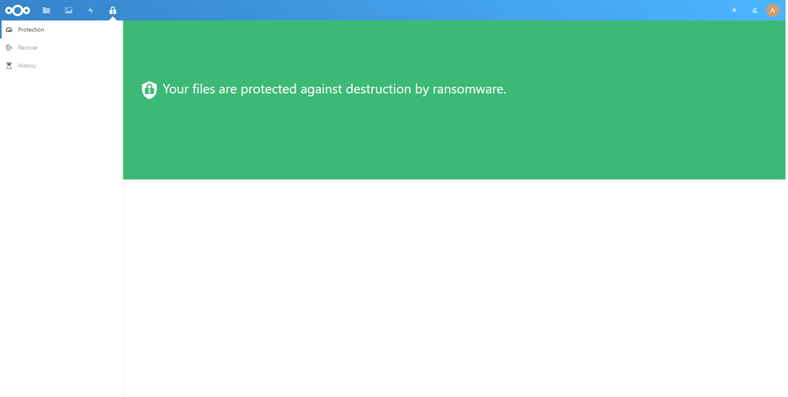

# **WARNING: Because of an open [problem](https://github.com/undo-ransomware/ransomware_detection/issues/48#issue-763599989) that can lead to the deletion of all files, I advise against using the current version 0.9.0. I have already removed this version from the Appstore. I recommend disabling the app until a fix is released.**

# Nextcloud Ransomware Recovery

**Ransomware detection with a guided user-controlled one-step recovery.**

This app monitors file operations during the synchronization to detect ransomware attacks. This is done by using generic indicators for a guided user-controlled one-step recovery utilizing the integrated file versioning methods.

## Features

* :exclamation:**Ransomware Detection:** Monitoring the file operations, analysing and classifying the collected data by using generic indicators allows a reliable detection.
* :computer:**Recovery Interface:**  The color coded results of the classification offer an easy-to-use recovery interface giving the user full control of the recovery process.
* :relaxed:**Guided Undo:** The guided user-controlled one-step recovery allows the user to quick and savely restore all - by ransomware - encrypted files without being affected by any false positives.

## Installation

In your Nextcloud, simply navigate to »Apps«, choose the category »Security«, find the Ransomware recovery app and enable it.
Then open the Ransomware recovery app from the app menu.

## Frequently Asked Questions

* *Can the Ransomware Recovery app used together with the Nextcloud official Ransomware Protection app?*  
Yes, it can be used together with the Nextloud official Ransomware Protection app.

* *What's the difference between the Ransomware Recovery app and the Nextcloud official Ransomware Protection app?*  
The difference between this apps is pretty simple: The Nextcloud official Ransomware Protection app uses white- and blacklisting of file extensions to protect you against ransomware files, this only works for already known ransomware families.
In contrast, the Ransomware Recovery app utilises the ransomware behaviour to mark possible ransomware attacks with an user-controlled recovery to give an easy-to-use mechanism to recover from unknown ransomware families.

## Acknowledgements

This project was created for the
[Undo Ransomware](https://prototypefund.de/project/undo-von-ransomware-mittels-machine-learning/)
Prototype Fund project.

